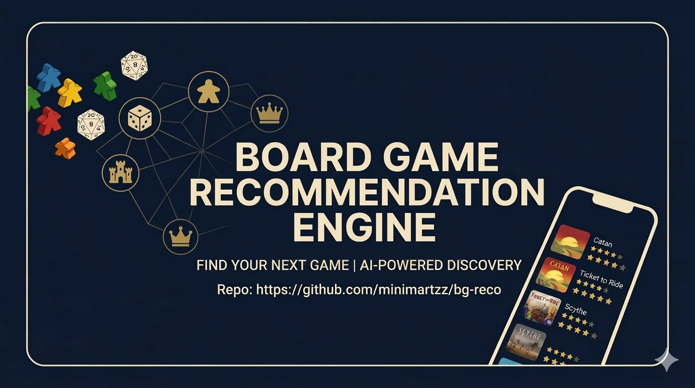

<div align="center">

  
  <h1>Board Game Recommender</h1>
  
  <p>
    Board games recommendation engine built using information from BGG
  </p>

</div>

<br />

<!-- Badges -->

## Tools

---

<br />

<!-- Table of Contents -->

# :notebook_with_decorative_cover: Table of Contents

- [About the Project](#star2-about-the-project)
- [Architecture](#building_construction-architecture)
- [Project Structure]()
- [Details on Data](#bookmark_tabs-details-on-data)
- [Limitations](#bookmark_tabs-details-on-data)
- [Contact](#handshake-contact)
- [Acknowledgements](#gem-acknowledgements)

<!-- About the Project -->

## :star2: About the Project

A board game recommendation engine that suggests board games based on the users play history and game ratings. Board games contain details like descriptions, categories, mechanics, etc. that can be used as suggestions for users from their past sessions.

## :building_construction: Architecture

A two-tower retrieval (Users & Games) + Cross-encoder reranking recommendation based on a users play history and game information with comments

IMG TO BE INCLUDED

## :file_folder: Project Structure

```
bg-reco/
├── data/
│   ├── boardgames_rank.csv       # Dataset of all board games on BGG
│   └── bgg_db.duckdb             # DuckDB instance of extracted comments
├── bgg-pull/
│   └── main.py                   # Entrypoint to pull BGG information
└── src/
    ├── config.py                 # Hyperparameters and feature lists
    ├── preprocessing.py          # CSV loading, tag parsing, normalisation
    ├── game_builder.py           # Game profile construction (embedding + tags + numerics)
    ├── user_builder.py           # User feature construction from play history
    ├── model.py                  # Two-tower model + reranker (PyTorch)
    ├── train.py                  # Training pipeline (two-phase)
    ├── test.py                   # Inference testing pipeline
    ├── inference.py              # Inference engine (retrieval + reranking)
    ├── api.py                    # FastAPI server
    ├── evaluate.py               # Model evaluation script
    ├── pyproject.toml            # Project requirements
    ├── Dockerfile                # Docker entrypoint
    └── model/
        ├── two_tower.pt
        ├── reranker.pt
        ├── game_index.json       # Pre-computed game tower embeddings
        ├── game_profiles.pkl     # Raw game feature vectors
        ├── tag_vocabs.pkl        # Tag vocabularies
        ├── scaler.pkl            # Numeric feature scaler
        ├── text_encoder.pkl      # Fitted text encoder
        ├── emb_cfg.pkl           # Embedding config
        └── meta.json             # Dimension metadata
```

## :racehorse: Quick Start

BGG Games Puller

```bash
# Install dependencies
uv sync

# Run the scraper with default options
cd bgg-pull
uv run main.py

# View more options
uv run main.py --help
```

## :bookmark_tabs: Details on Data

- Board game details: Information extracted from BGG API
- Player sessions details: Taken from another project of mine, [Trakka](https://github.com/minimartzz/trakka)

## :stop_sign: Limitations

1. (user, game) pairs only account for the first instance of play during training.
2. User-user coplay (users who played together tend to have similar taste) are not accounted for

## :handshake: Contact

Author: Martin Ho

Project Link: [Github](https://github.com/minimartzz/bg-reco)

<!-- Acknowledgments -->

## :gem: Acknowledgements

- Technology Badges: [alexandreanlim](https://github.com/alexandresanlim/Badges4-README.md-Profile) & [Ileriayo](https://github.com/Ileriayo/markdown-badges?tab=readme-ov-file#table-of-contents)
